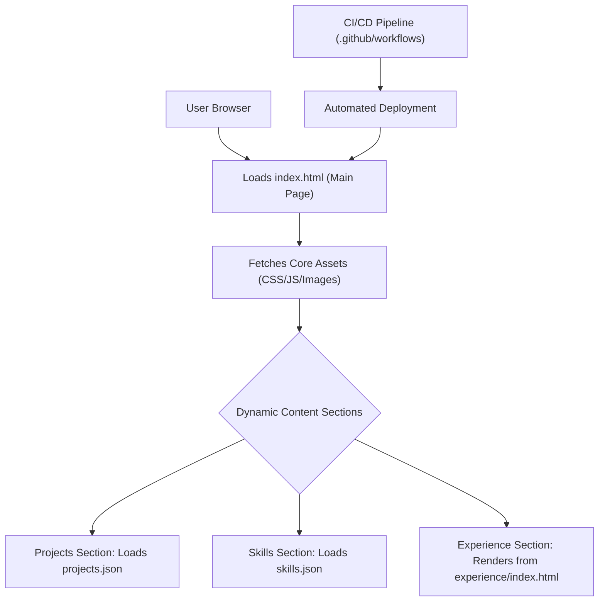

# 🚀 Dynamic Developer Portfolio Website

<p align="center"></p>

## Short Description

Unveiling a modern, responsive, and highly interactive online portfolio designed to effectively showcase a developer's skills, projects, and professional journey. This meticulously crafted static website serves as a dynamic resume, offering an immersive experience for visitors to explore technical proficiencies and impactful work.

## ✨ Key Features

*   **Striking Visual Design:** A clean, contemporary aesthetic with fluid animations and interactive elements powered by JavaScript and CSS.
*   **Comprehensive Project Showcase:** Dedicated section highlighting diverse projects, complete with dynamic loading of project details from `projects.json`.
*   **Detailed Experience Timeline:** Clearly articulates professional journey, roles, and achievements, offering insights into career progression.
*   **Organized Skill Mastery Display:** Presents technical proficiencies in an accessible and engaging format, pulling data from `skills.json`.
*   **Integrated Resume Access:** Provides quick and easy access to a downloadable professional resume (`assests/resume.pdf`).
*   **Automated CI/CD Pipeline:** Leverages GitHub Actions (`.github/workflows/ci-cd.yml`) for seamless integration and deployment of updates.
*   **Custom 404 Page:** Enhanced user experience with a custom error page for graceful navigation.
*   **Performance Optimized:** Built for speed and responsiveness across all devices, ensuring a smooth user experience.

## Who is this for?

This project is ideal for:

*   **Aspiring Developers:** To inspire and provide a robust template for creating their own professional online presence.
*   **Recruiters & Hiring Managers:** Offering a streamlined and engaging platform to evaluate a candidate's technical capabilities and portfolio.
*   **Potential Clients & Collaborators:** Demonstrating expertise and project quality, fostering new opportunities.
*   **Self-Promoters:** Anyone looking to powerfully present their development skills and achievements to a global audience.

## Technology Stack & Architecture

This portfolio is a testament to robust static web development practices. It is built using:

*   **Frontend:**
    *   **HTML5:** For semantic structure and content organization.
    *   **CSS3:** For modern styling, responsiveness, and aesthetic appeal.
    *   **JavaScript (Vanilla):** For interactive elements, dynamic content loading (e.g., projects, skills), and enhancing user experience (e.g., `particles.min.js`).
*   **Development Tools:**
    *   **VS Code:** Configured for an efficient development workflow.
    *   **GitHub Actions:** For continuous integration and continuous deployment, ensuring automated build and deployment processes.

## 📊 Architecture & Database Schema

As a static website, this project focuses on client-side rendering with JSON files acting as lightweight data sources. There is no backend database. The architecture follows a clear separation of concerns, ensuring maintainability and scalability for content updates.



## ⚡ Quick Start Guide

Get your own dynamic portfolio up and running in minutes!

1.  **Clone the repository:**
    ```bash
    git clone https://github.com/achalsargar-git/portfolio_website.git
    ```
2.  **Navigate to the project directory:**
    ```bash
    cd portfolio_website
    ```
3.  **Open in your browser:**
    Simply open the `index.html` file in your preferred web browser to view the portfolio.
    ```bash
    # Example for macOS
    open index.html
    # Example for Windows
    start index.html
    ```
4.  **Customize:** Update `projects/projects.json`, `skills.json`, `assests/resume.pdf`, and the HTML/CSS/JS files to personalize the content for your own portfolio.

## 📜 License

This project is licensed under the terms specified in the `LICENSE` file within this repository.